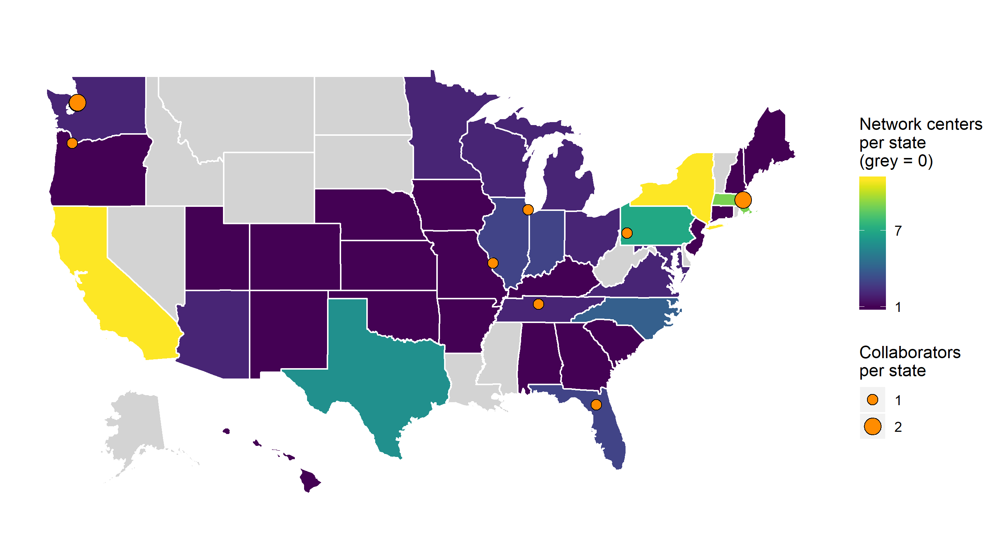

# vizome_map

Made a map figure for a couple of grants. 

* States are coloured by number of network member centers in each
* Points indicate grant collaborators. Size of points indicates number of collaborators per state, since many centers are in the same area and would not be distinguishable on the map (e.g. UCLA and USC).
* Also turned the code into a [tutorial](https://github.com/lopierra/vizome_map/blob/master/vizome_map_for_rgroup.Rmd) for R Learning Group.

